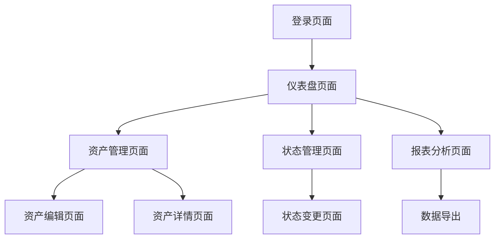

## 1. 产品概述
资产管理系统是一个现代化的企业级Web应用，帮助企业高效管理和跟踪各类资产。系统提供资产的录入、分类、状态跟踪、统计分析等核心功能，让资产管理变得简单直观。

目标用户包括企业的资产管理员、财务人员、部门负责人等，通过数字化管理提升资产利用率，降低管理成本，实现资产全生命周期管理。

## 2. 核心功能

### 2.1 用户角色
| 角色 | 注册方式 | 核心权限 |
|------|----------|----------|
| 管理员 | 后台创建 | 系统管理、用户管理、资产全权限 |
| 资产管理员 | 管理员创建 | 资产增删改查、状态管理、报表查看 |
| 普通用户 | 邮箱注册 | 资产查看、个人资产申请 |

### 2.2 功能模块
系统包含以下主要页面：
1. **登录页面**：用户认证、密码重置。
2. **仪表盘页面**：资产总览、统计图表、快速操作入口。
3. **资产管理页面**：资产列表、搜索筛选、资产详情、批量操作。
4. **资产编辑页面**：资产信息录入、图片上传、状态设置。
5. **状态管理页面**：借出归还、维修报废、历史记录。
6. **报表分析页面**：资产统计、分类分析、导出功能。

### 2.3 页面详情
| 页面名称 | 模块名称 | 功能描述 |
|-----------|----------|----------|
| 登录页面 | 用户登录 | 输入用户名密码进行身份验证，支持记住密码功能。 |
| 登录页面 | 密码重置 | 通过邮箱验证重置登录密码。 |
| 仪表盘页面 | 资产总览 | 显示资产总数、总价值、在用数量、维修数量等关键指标。 |
| 仪表盘页面 | 统计图表 | 展示资产分类饼图、资产趋势折线图、部门资产柱状图。 |
| 仪表盘页面 | 快速入口 | 提供添加资产、资产查询、状态变更等快捷操作按钮。 |
| 资产管理页面 | 资产列表 | 以表格形式展示所有资产，包含编号、名称、分类、状态、价值等字段。 |
| 资产管理页面 | 搜索筛选 | 支持按名称、编号、分类、状态、部门等多条件组合搜索。 |
| 资产管理页面 | 批量操作 | 支持批量删除、批量导出、批量状态变更等操作。 |
| 资产编辑页面 | 基本信息 | 录入资产名称、编号、分类、规格、采购日期、价值等基础信息。 |
| 资产编辑页面 | 图片上传 | 支持上传资产照片，最多5张图片。 |
| 资产编辑页面 | 状态设置 | 设置资产初始状态（在用、库存、维修等）。 |
| 状态管理页面 | 状态流转 | 处理资产的借出、归还、维修、报废等状态变更。 |
| 状态管理页面 | 历史记录 | 记录每次状态变更的时间、操作人、原因等信息。 |
| 报表分析页面 | 资产统计 | 按分类、部门、时间等维度统计资产数据。 |
| 报表分析页面 | 数据导出 | 支持导出Excel、PDF格式的报表文件。 |

## 3. 核心流程
用户主要操作流程如下：

**普通用户流程**：
登录系统 → 查看仪表盘 → 浏览资产列表 → 申请资产借用 → 查看个人资产 → 归还资产

**资产管理员流程**：
登录系统 → 查看仪表盘 → 添加新资产 → 处理资产申请 → 变更资产状态 → 生成统计报表

**管理员流程**：
登录系统 → 用户管理 → 系统配置 → 数据备份 → 权限管理

## 4. 用户界面设计

### 4.1 设计风格
- **主色调**：蓝色系（#1890ff）为主，体现专业可靠的企业形象
- **辅助色**：绿色（#52c41a）表示正常状态，橙色（#fa8c16）表示警告，红色（#f5222d）表示错误
- **按钮样式**：圆角矩形设计，主要操作为实心按钮，次要操作为线框按钮
- **字体选择**：系统默认字体，标题16-18px，正文14px，小字12px
- **布局风格**：左侧导航菜单 + 顶部工具栏 + 主内容区域的经典布局
- **图标风格**：使用Ant Design图标库，线性图标，简洁现代

### 4.2 页面设计概览
| 页面名称 | 模块名称 | UI元素 |
|-----------|----------|----------|
| 仪表盘页面 | 资产总览 | 使用卡片式布局展示关键指标，每个指标配有相应图标，数字使用大字体突出显示。 |
| 仪表盘页面 | 统计图表 | 使用ECharts图表库，饼图展示资产分类占比，折线图展示资产变化趋势。 |
| 资产管理页面 | 资产列表 | 表格采用斑马纹设计，操作按钮使用图标+文字形式，顶部放置搜索和筛选控件。 |
| 资产编辑页面 | 基本信息 | 采用表单布局，必填项用红色星号标记，分组显示不同类型的信息。 |
| 状态管理页面 | 状态流转 | 使用时间轴组件展示状态变更历史，当前状态用醒目颜色标识。 |

### 4.3 响应式设计
系统采用桌面端优先的设计方案，主界面针对1920×1080分辨率优化设计。同时支持响应式布局，在平板和笔记本上能够自适应显示。移动端采用特殊的布局适配，将左侧导航转换为顶部汉堡菜单，表格数据在小屏幕上转换为卡片形式展示。

### 4.4 交互设计
- **加载状态**：数据加载时显示骨架屏，操作执行时显示加载动画
- **反馈机制**：操作成功显示绿色提示，错误显示红色警告，重要操作需要二次确认
- **快捷键**：支持常用操作的键盘快捷键，如Ctrl+S保存，Ctrl+F搜索
- **批量操作**：支持多选功能，选中后显示批量操作工具栏