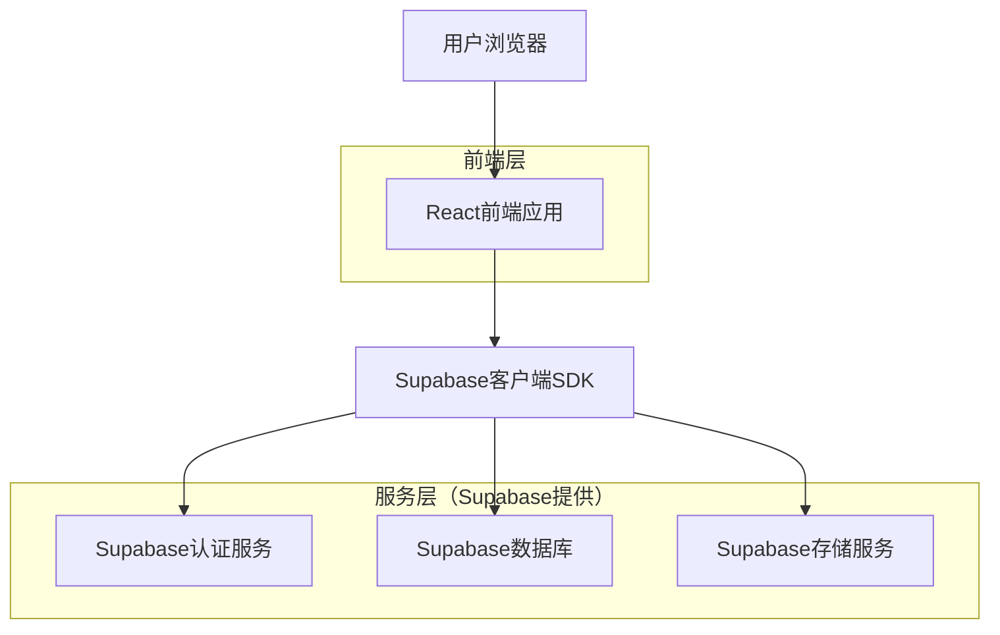
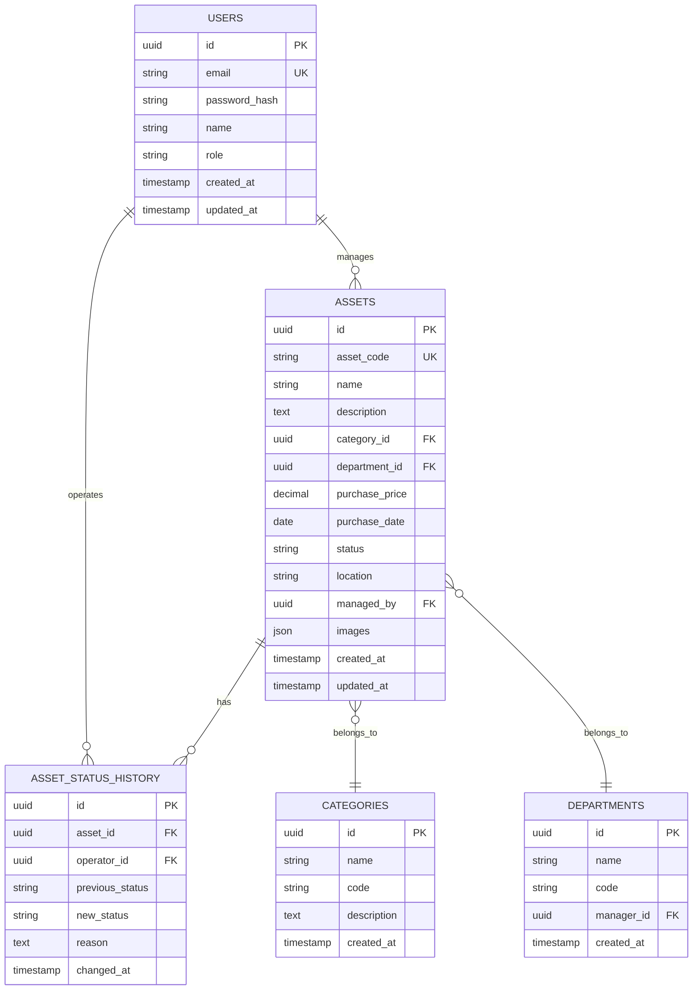
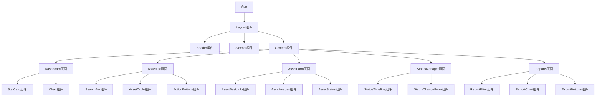

## 1. 架构设计



## 2. 技术栈描述

* **前端框架**: React\@18 + TypeScript

* **构建工具**: Vite\@5

* **UI组件库**: Ant Design\@5 + Tailwind CSS\@3

* **状态管理**: React Context + useReducer

* **图表库**: ECharts\@5

* **后端服务**: Supabase（提供认证、数据库、文件存储）

* **初始化工具**: vite-init

## 3. 路由定义

| 路由路径        | 页面用途             |
| ----------- | ---------------- |
| /login      | 登录页面，用户身份验证      |
| /dashboard  | 仪表盘页面，展示资产总览和统计  |
| /assets     | 资产管理页面，资产列表和管理   |
| /assets/new | 新建资产页面，添加新资产     |
| /assets/:id | 资产详情页面，查看和编辑资产信息 |
| /status     | 状态管理页面，处理资产状态变更  |
| /reports    | 报表分析页面，数据统计和导出   |
| /settings   | 系统设置页面，用户管理和配置   |

## 4. 数据模型定义

### 4.1 实体关系图



### 4.2 数据定义语言

**用户表 (users)**

```sql
-- 创建用户表
CREATE TABLE users (
  id UUID PRIMARY KEY DEFAULT gen_random_uuid(),
  email VARCHAR(255) UNIQUE NOT NULL,
  password_hash VARCHAR(255) NOT NULL,
  name VARCHAR(100) NOT NULL,
  role VARCHAR(20) DEFAULT 'user' CHECK (role IN ('admin', 'manager', 'user')),
  created_at TIMESTAMP WITH TIME ZONE DEFAULT NOW(),
  updated_at TIMESTAMP WITH TIME ZONE DEFAULT NOW()
);

-- 创建索引
CREATE INDEX idx_users_email ON users(email);
CREATE INDEX idx_users_role ON users(role);
```

**资产表 (assets)**

```sql
-- 创建资产表
CREATE TABLE assets (
  id UUID PRIMARY KEY DEFAULT gen_random_uuid(),
  asset_code VARCHAR(50) UNIQUE NOT NULL,
  name VARCHAR(200) NOT NULL,
  description TEXT,
  category_id UUID REFERENCES categories(id),
  department_id UUID REFERENCES departments(id),
  purchase_price DECIMAL(12,2),
  purchase_date DATE,
  status VARCHAR(20) DEFAULT 'in_stock' CHECK (status IN ('in_stock', 'in_use', 'maintenance', 'disposed')),
  location VARCHAR(200),
  managed_by UUID REFERENCES users(id),
  images JSONB DEFAULT '[]',
  created_at TIMESTAMP WITH TIME ZONE DEFAULT NOW(),
  updated_at TIMESTAMP WITH TIME ZONE DEFAULT NOW()
);

-- 创建索引
CREATE INDEX idx_assets_code ON assets(asset_code);
CREATE INDEX idx_assets_status ON assets(status);
CREATE INDEX idx_assets_category ON assets(category_id);
CREATE INDEX idx_assets_department ON assets(department_id);
```

**分类表 (categories)**

```sql
-- 创建分类表
CREATE TABLE categories (
  id UUID PRIMARY KEY DEFAULT gen_random_uuid(),
  name VARCHAR(100) NOT NULL,
  code VARCHAR(20) UNIQUE NOT NULL,
  description TEXT,
  created_at TIMESTAMP WITH TIME ZONE DEFAULT NOW()
);
```

**部门表 (departments)**

```sql
-- 创建部门表
CREATE TABLE departments (
  id UUID PRIMARY KEY DEFAULT gen_random_uuid(),
  name VARCHAR(100) NOT NULL,
  code VARCHAR(20) UNIQUE NOT NULL,
  manager_id UUID REFERENCES users(id),
  created_at TIMESTAMP WITH TIME ZONE DEFAULT NOW()
);
```

**资产状态历史表 (asset\_status\_history)**

```sql
-- 创建状态历史表
CREATE TABLE asset_status_history (
  id UUID PRIMARY KEY DEFAULT gen_random_uuid(),
  asset_id UUID REFERENCES assets(id) ON DELETE CASCADE,
  operator_id UUID REFERENCES users(id),
  previous_status VARCHAR(20),
  new_status VARCHAR(20) NOT NULL,
  reason TEXT,
  changed_at TIMESTAMP WITH TIME ZONE DEFAULT NOW()
);

-- 创建索引
CREATE INDEX idx_status_history_asset ON asset_status_history(asset_id);
CREATE INDEX idx_status_history_changed_at ON asset_status_history(changed_at DESC);
```

### 4.3 权限设置

```sql
-- 基本访问权限
GRANT SELECT ON users TO anon;
GRANT SELECT ON assets TO anon;
GRANT SELECT ON categories TO anon;
GRANT SELECT ON departments TO anon;

-- 认证用户权限
GRANT ALL PRIVILEGES ON users TO authenticated;
GRANT ALL PRIVILEGES ON assets TO authenticated;
GRANT ALL PRIVILEGES ON categories TO authenticated;
GRANT ALL PRIVILEGES ON departments TO authenticated;
GRANT ALL PRIVILEGES ON asset_status_history TO authenticated;

-- RLS策略（行级安全）
ALTER TABLE assets ENABLE ROW LEVEL SECURITY;
CREATE POLICY "用户只能查看自己部门的资产" ON assets
  FOR SELECT USING (
    department_id IN (
      SELECT department_id FROM users WHERE id = auth.uid()
    ) OR EXISTS (
      SELECT 1 FROM users WHERE id = auth.uid() AND role = 'admin'
    )
  );
```

## 5. 组件架构设计

### 5.1 组件层次结构



### 5.2 核心组件说明

**Layout组件**: 整体布局框架，包含头部导航、侧边栏菜单和主内容区域

**Dashboard组件**: 仪表盘页面，集成统计卡片、图表展示等子组件

**AssetTable组件**: 资产表格组件，支持分页、排序、筛选功能

**AssetForm组件**: 资产表单组件，处理资产信息的增删改查

**StatusTimeline组件**: 状态时间轴组件，展示资产状态变更历史

**Chart组件**: 图表组件，基于ECharts封装，支持多种图表类型

## 6. 状态管理设计

### 6.1 全局状态结构

```typescript
interface AppState {
  auth: {
    user: User | null;
    isAuthenticated: boolean;
    loading: boolean;
  };
  assets: {
    list: Asset[];
    total: number;
    loading: boolean;
    filters: AssetFilters;
  };
  categories: Category[];
  departments: Department[];
  notifications: Notification[];
}
```

### 6.2 状态管理策略

* **认证状态**: 使用React Context管理用户登录状态和权限信息

* **资产数据**: 使用useReducer管理资产列表、筛选条件和分页状态

* **UI状态**: 组件内部使用useState管理表单、模态框等UI状态

* **缓存策略**: 使用React Query进行数据缓存和同步

## 7. 性能优化策略

### 7.1 前端优化

* **代码分割**: 按路由进行代码分割，减少初始加载时间

* **懒加载**: 图表库、大文件采用动态导入

* **虚拟滚动**: 资产列表采用虚拟滚动技术处理大量数据

* **图片优化**: 支持WebP格式，图片懒加载和压缩

### 7.2 数据优化

* **分页加载**: 资产列表分页获取，避免一次性加载大量数据

* **索引优化**: 数据库字段建立合适索引，提升查询性能

* **数据缓存**: 静态数据如分类、部门信息本地缓存

* **实时更新**: 使用Supabase实时功能，数据变更即时同步

## 8. 安全设计

### 8.1 前端安全

* **输入验证**: 表单输入进行前端验证和消毒处理

* **XSS防护**: 使用React自动转义机制防止XSS攻击

* **权限控制**: 前端路由守卫，根据用户权限控制页面访问

* **敏感信息**: 敏感数据加密存储，避免明文传输

### 8.2 后端安全

* **行级安全**: 使用Supabase RLS策略控制数据访问权限

* **SQL注入**: 使用参数化查询，避免SQL注入风险

* **文件上传**: 限制文件类型和大小，病毒扫描

* **审计日志**: 记录重要操作日志，便于安全审计

